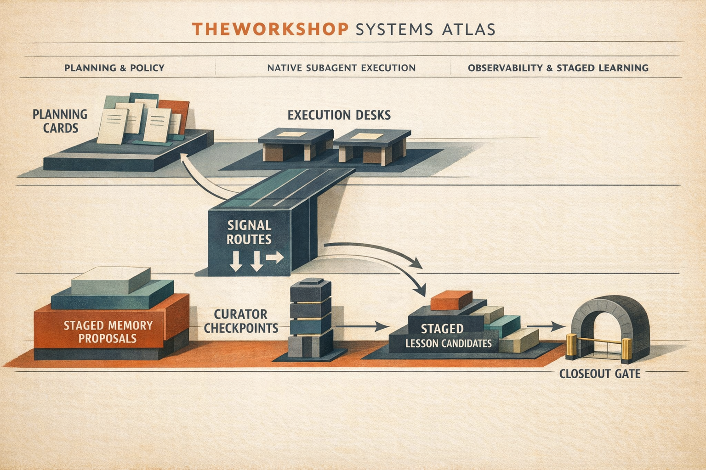

# TheWorkshop

[](https://github.com/ashirgruder/theworkshop/releases/latest)
[](./LICENSE)

**TheWorkshop Open Source Edition** is a Project OS for non-coding work.

It turns ambiguous requests into a living execution system:

**Project -> Workstreams -> Jobs**

with explicit gates, orchestration, monitoring, lessons learned, and spend visibility.

## Systems Architecture

The diagram below shows TheWorkshop's control plane (planning, gating, orchestration) and execution plane (work execution, outputs, monitoring).



## What It Is

- A structured runtime for non-coding projects
- Agreement-gated before execution starts
- Truth-gated and reward-gated before completion claims
- Parallel-orchestration aware (sub-agents when independent jobs exist)
- Dashboard-first monitoring with token/spend telemetry

## What It Is Not

- A replacement for human strategic ownership
- A generic code framework or web app product
- A system that marks work complete on artifact presence alone

## Core Model

- `Project`: top-level outcome and success definition
- `Workstream`: coherent thread in support of project goal
- `Job` (`Work Item`): smallest executable/verifiable unit
- `Wave` (optional): timeboxed grouping across workstreams

Completion promises are explicit:

- `<promise>{ID}-DONE</promise>`

## Gate Model

A job can only transition to `done` when all gates pass:

1. Agreement gate (scope accepted before execution)
2. Dependency/freshness gate (inputs are current)
3. TruthGate (verification of correctness)
4. Reward gate (meets `reward_target`)

## Install

```bash
cp -R /path/to/theworkshop "$CODEX_HOME/skills/theworkshop"
```

Typical destination:

- `$CODEX_HOME/skills/theworkshop`
- usually `~/.codex/skills/theworkshop`

## Reproducible Quick Start

```bash
# create project
python3 scripts/project_new.py --name "Workshop Demo"

# add workstream + job
python3 scripts/workstream_add.py --project /path/to/project --title "Research"
python3 scripts/job_add.py --project /path/to/project --workstream WS-YYYYMMDD-001 --title "Draft options memo"

# validate and orchestrate
python3 scripts/plan_check.py --project /path/to/project
python3 scripts/optimize_plan.py --project /path/to/project
python3 scripts/orchestrate_plan.py --project /path/to/project

# execute one job
python3 scripts/job_start.py --project /path/to/project --work-item-id WI-YYYYMMDD-001
python3 scripts/job_complete.py --project /path/to/project --work-item-id WI-YYYYMMDD-001 --cascade
```

Expected core outputs:

- `outputs/dashboard.html`
- `outputs/dashboard.json`
- `outputs/dashboard.md`
- `outputs/<date>-task-tracker.csv`
- `logs/execution.jsonl`
- `artifacts/truth-report.json`

## Monitoring + Spend Semantics

- Dashboard auto-opens best-effort at execution start (unless disabled)
- Auto-refresh supports stale detection and pause/resume
- Cost display is billing-aware:
  - `subscription_auth`: billed cost shown as `$0` marginal, API-equivalent shown secondarily
  - `metered_api`: billed cost from exact telemetry when available
  - `unknown`: estimate-first fallback

## Image Generation Path

Use work-item scoped image generation:

```bash
python3 scripts/imagegen_job.py --project /path/to/project --work-item-id WI-YYYYMMDD-002
```

Auth semantics:

- Canonical keychain secret: `OPENAI_KEY`
- Compatibility injection for image tooling: `OPENAI_API_KEY`

## Reliability Checks

```bash
python3 scripts/doctor.py
cd scripts && for t in *_test.py; do python3 "$t"; done
```

## Open-Source Workflow

- Contribution guidelines: [CONTRIBUTING.md](CONTRIBUTING.md)
- Support boundaries: [SUPPORT.md](SUPPORT.md)
- Security reporting: [SECURITY.md](SECURITY.md)

## Roadmap

### Now

- Stable `v0.1.0` baseline for Project -> Workstreams -> Jobs control plane
- TruthGate + stale invalidation + orchestration artifacts
- Billing-aware spend in dashboard

### Next

- More robust synthetic scenario suite for document-quality outcomes
- Additional dashboard drilldowns for truth/reward failure analysis
- GitHub mirror ergonomics and dry-run diagnostics

### Later

- Optional docs site for deeper operators manual
- Broader template library for non-coding domains
- Extended export/report bundles for stakeholder handoff

## Repository Layout

```text
theworkshop/
  README.md
  SKILL.md
  CHANGELOG.md
  scripts/
  references/
  examples/
  docs/assets/
  .github/
```

## License

MIT. See [LICENSE](LICENSE).
