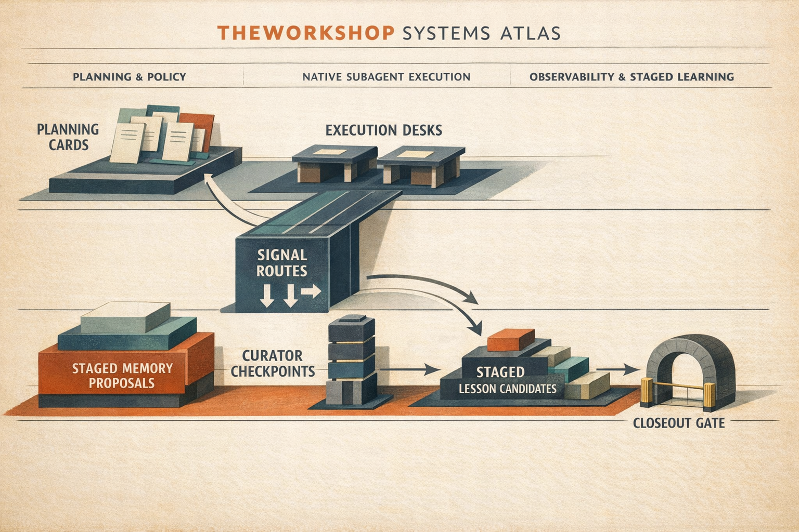
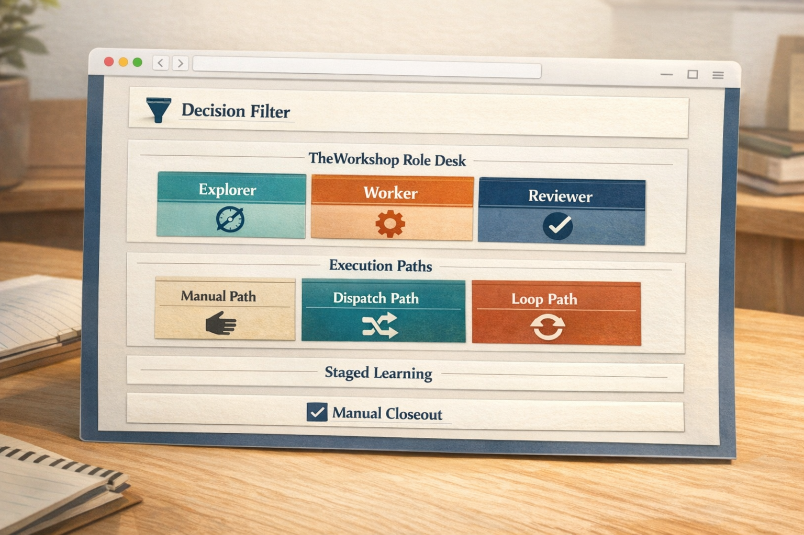

# TheWorkshop

[](https://github.com/CongressionalInsights/theworkshop/releases/latest)
[](./LICENSE)

**TheWorkshop Open Source Edition** is a **skill for Codex and Claude Code** that runs mixed coding and non-coding work in a structured, auditable way.

It turns ambiguous requests into a living execution workflow:

**Project -> Workstreams -> Jobs**

with explicit gates, orchestration, monitoring, lessons learned, and spend visibility.

## Plain-English Definition

When this repo says **\"project OS\"**, it means:

- a repeatable workflow system for the agent
- **not** an operating system
- implemented as a skill the agent runs inside Codex/Claude Code

## Systems Architecture

The diagram below reflects the current OSS baseline:

- planning metadata and agreement live in the control plane
- native Codex subagents are the execution runtime
- telemetry, staged learning, and explicit closeout keep delegation truthful



## Interactive Subagent Explainer

The repo now ships with a self-contained explainer page at:

- [`docs/subagents.html`](docs/subagents.html)

It is designed to open locally after install and covers:

- the broad Codex subagent model
- when delegation is worth the coordination cost
- built-in roles versus repo-scoped TheWorkshop roles
- dispatch, manual, and loop execution paths
- staged lessons and durable memory promotion
- explicit manual closeout through `theworkshop agent-closeout`



## Autoresearch-Style Skill Tuning

The repo also includes an optional outer-loop harness in [`autoresearch/`](autoresearch/README.md) for refining the **skill surface** without opening up the whole repository to autonomous mutation.

- control file: `autoresearch/program.md`
- benchmark packs: `autoresearch/benchmark-pack.fast.json`, `autoresearch/benchmark-pack.full.json`
- evaluator: `python3 scripts/skill_autoresearch_eval.py`
- scored contract benchmark: `python3 scripts/skill_surface_contract_score.py --repo .`

The default writable surface is limited to operator-facing docs and repo-local agent definitions, and results can be logged to the ignored `state/autoresearch/results.tsv` path. Benchmark-maintenance commits should be kept separate from scored skill-surface experiments, because the scope guard intentionally rejects changes outside that writable surface.

## What It Is

- A **Codex/Claude Code skill**, not a standalone app
- A structured runtime for mixed coding and non-coding projects
- Agreement-gated before execution starts
- Truth-gated and reward-gated before completion claims
- Parallel-orchestration aware (native Codex subagents for independent bounded jobs)
- Dashboard-first monitoring with token/spend telemetry
- A repo-owned `WORKFLOW.md` contract for unattended local execution

## What It Is Not

- A replacement for human strategic ownership
- A generic code framework or web app product
- A system that marks work complete on artifact presence alone

## Public Baseline Vs. Local Custom

This repository is the **public OSS baseline** for TheWorkshop.

- It defines the portable local framework and the optional adapters that ship in the public repo.
- It does **not** claim to contain or standardize private/custom operator workflows.
- Richer local/custom versions can exist separately, but they are outside the contract of this repository.

## Portable Local Framework Profile

The repo remains **Codex-first** in top-level docs, but the public package is intentionally usable as a **portable local framework**.

Portable/core path:
- project/workstream/job lifecycle and gates
- dashboard build/projector and local monitoring
- workflow contract and workflow runner
- schemas, examples, and regression suite

Optional adapters:
- Codex session telemetry / CodexBar spend
- Gemini / OpenAI council planning
- Apple Keychain credential path
- imagegen skill bridge
- GitHub mirroring

Capability matrix:

| Capability | Portable core | Codex-enhanced | Optional adapter |
| --- | --- | --- | --- |
| Lifecycle / gates | Yes | Yes | No |
| Dashboard / runtime | Yes | Yes | No |
| Workflow runner | Yes | Yes | No |
| Billing / spend telemetry | Fallback / unknown | Yes | Codex session logs / CodexBar |
| Council planning | Dry-run only | Yes | Gemini / OpenAI |
| Image generation | No | Yes | imagegen skill / keychain |
| GitHub mirror | No | Yes | `gh` |

## Core Model

- `Project`: top-level outcome and success definition
- `Workstream`: coherent thread in support of project goal
- `Job` (`Work Item`): smallest executable/verifiable unit
- `Wave` (optional): timeboxed grouping across workstreams

Completion promises are explicit:

- `<promise>{ID}-DONE</promise>`

## Gate Model

A job can only transition to `done` when all gates pass:

1. Agreement gate (scope accepted before execution)
2. Dependency/freshness gate (inputs are current)
3. TruthGate (verification of correctness)
4. Reward gate (meets `reward_target`)

Execution quality defaults:
- `job_start.py` auto-applies ranked lessons into `# Relevant Lessons Learned` (override: `--no-apply-lessons`).
- `plan_check.py` warns on weak placeholder content for `planned` jobs and hard-fails weak content for `in_progress`/`done` jobs.

## Install

```bash
# One command from the repo root
git clone https://github.com/CongressionalInsights/theworkshop.git
mkdir -p "$CODEX_HOME/skills"
cp -R theworkshop "$CODEX_HOME/skills/theworkshop"
```

Typical destination:

- `$CODEX_HOME/skills/theworkshop`
- usually `~/.codex/skills/theworkshop`

To update later:

```bash
cd "$CODEX_HOME/skills/theworkshop" && git pull origin main
```

## Reproducible Quick Start

```bash
# create project
python3 scripts/project_new.py --name "Workshop Demo"

# inspect the generated execution contract
python3 scripts/workflow_check.py --project /path/to/project

# add workstream + job
python3 scripts/workstream_add.py --project /path/to/project --title "Research"
python3 scripts/job_add.py --project /path/to/project --workstream WS-YYYYMMDD-001 --title "Draft options memo"
python3 scripts/job_add.py --project /path/to/project --workstream WS-YYYYMMDD-001 --title "Attribution sweep" --job-profile investigation_attribution
python3 scripts/job_add.py --project /path/to/project --workstream WS-YYYYMMDD-001 --title "Entity resolution" --job-profile identity_resolution
python3 scripts/discuss.py --project /path/to/project --work-item-id WI-YYYYMMDD-001 --decision "Use concise format" --required --no-interactive

# validate and orchestrate
python3 scripts/plan_check.py --project /path/to/project
python3 scripts/schema_validate.py --project /path/to/project
python3 scripts/optimize_plan.py --project /path/to/project
python3 scripts/orchestrate_plan.py --project /path/to/project
python3 scripts/dispatch_orchestration.py --project /path/to/project --dry-run
python3 scripts/council_plan.py --project /path/to/project --dry-run
python3 scripts/workflow_runner.py --project /path/to/project --once
python3 scripts/workflow_runner.py --project /path/to/project --detach

# execute one job
python3 scripts/job_start.py --project /path/to/project --work-item-id WI-YYYYMMDD-001
python3 scripts/job_start.py --project /path/to/project --work-item-id WI-YYYYMMDD-001 --lessons-limit 5 --lessons-include-global
python3 scripts/verify_work.py --project /path/to/project --work-item-id WI-YYYYMMDD-001
python3 scripts/job_complete.py --project /path/to/project --work-item-id WI-YYYYMMDD-001 --cascade

# optional utility lanes
python3 scripts/health.py --project /path/to/project --repair
python3 scripts/quick.py --project /path/to/project --title "One-off patch" --command "echo done"
python3 scripts/dashboard_server.py --project /path/to/project --open
```

Every project now gets a `WORKFLOW.md` file at the project root. It is the repo-owned execution
contract for unattended runs: polling cadence, dispatch defaults, pre/post cycle hooks, and the
shared execution-policy prompt prepended to delegated work-item prompts.

When parallel work is justified, TheWorkshop treats native Codex subagents as the default
delegation runtime. TheWorkshop orchestration decides which jobs are safe to delegate; the parent
thread stays responsible for planning, integration, and final synthesis.

TheWorkshop also treats learning capture as a first-class runtime concern:

- shared cross-repo agents can live in `~/.codex/agents/`
- repo-specific workshop agents live in `.codex/agents/`
- delegated and looped work may read durable memory, but should stage new durable findings in:
  - `.theworkshop/memory-proposals/*.json`
  - `.theworkshop/lessons-candidates/*.json`
- only curator agents or the parent thread should promote those staged findings into:
  - `$CODEX_HOME/memories/projects/*.md`
  - `notes/lessons-learned.md`
- manual/external delegated runs should use `theworkshop agent-log` for intermediate telemetry and `theworkshop agent-closeout` once for terminal closeout plus staged learning promotion

Expected core outputs:

- `outputs/dashboard.html`
- `outputs/dashboard.json`
- `outputs/dashboard.md`
- `outputs/<date>-task-tracker.csv`
- `logs/execution.jsonl`
- `artifacts/truth-report.json`
- `notes/context/<WS-or-WI>-CONTEXT.md`
- `outputs/uat/<run-id>-UAT.md`
- `outputs/uat/<run-id>-UAT.json`
- `outputs/health.json`
- `quick/<id>-<slug>/plan.md`
- `quick/<id>-<slug>/summary.md`

## Monitoring + Spend Semantics

- Dashboard auto-opens best-effort once per session at execution start (unless disabled)
- Auto-refresh supports stale detection and pause/resume
- Optional local live transport: `python3 scripts/dashboard_server.py --project /path/to/project`
  - serves `dashboard.html` over `http://127.0.0.1:*`
  - publishes `/events` SSE updates so the page can switch from poll mode to live mode
- `monitor_runtime.py` owns dashboard open/watch/serve/stop/cleanup so repeated lifecycle events reuse the same runtime instead of spawning fresh browser/server state
- Project terminal closeout prunes transient runtime artifacts while preserving canonical outputs, logs, and dashboard artifacts
- Cost display is billing-aware when the **Codex telemetry adapter** is available:
  - `subscription_auth`: billed cost shown as `$0` marginal, API-equivalent shown secondarily
  - `metered_api`: billed cost from exact telemetry when available
  - `unknown`: estimate-first fallback

## Image Generation Path

Use work-item scoped image generation through the **optional imagegen adapter**:

```bash
python3 scripts/imagegen_job.py --project /path/to/project --work-item-id WI-YYYYMMDD-002
python3 scripts/imagegen_job.py --project /path/to/project --work-item-id WI-YYYYMMDD-002 --credential-provider env
python3 scripts/imagegen_job.py --project /path/to/project --work-item-id WI-YYYYMMDD-002 --credential-provider keychain --approve ttl:1h
```

Set one provider before first run:

```bash
export THEWORKSHOP_IMAGEGEN_API_KEY=...
```

Compatibility for existing local setups:

```bash
export OPENAI_API_KEY=...
```

Optional legacy keychain flow:

```bash
export THEWORKSHOP_IMAGEGEN_CREDENTIAL_SOURCE=keychain
export THEWORKSHOP_KEYCHAIN_SERVICE=OPENAI_KEY
```

The `apple-keychain` skill remains optional and cross-platform fallback behavior is env-first.

## Reliability Checks

```bash
python3 scripts/doctor.py --profile codex
python3 scripts/doctor.py --profile portable
cd scripts && for t in *_test.py; do python3 "$t"; done
```

## One-Command Install

```bash
./scripts/install_skill.sh --force
```

Use `--link` for a symlinked dev install.

## Open-Source Workflow

- Contribution guidelines: [CONTRIBUTING.md](CONTRIBUTING.md)
- Support boundaries: [SUPPORT.md](SUPPORT.md)
- Security reporting: [SECURITY.md](SECURITY.md)

## Roadmap

### Now

- Stable `v0.1.0` baseline for Project -> Workstreams -> Jobs control plane
- TruthGate + stale invalidation + orchestration artifacts
- Billing-aware spend in dashboard

### Next

- More robust synthetic scenario suite for document-quality outcomes
- Additional dashboard drilldowns for truth/reward failure analysis
- GitHub mirror ergonomics and dry-run diagnostics

### Later

- Optional docs site for deeper operators manual
- Broader template library for non-coding domains
- Extended export/report bundles for stakeholder handoff

## Repository Layout

```text
theworkshop/
  README.md
  SKILL.md
  CHANGELOG.md
  scripts/
  references/
  examples/
  docs/subagents.html
  docs/assets/
  .github/
```

## License

MIT. See [LICENSE](LICENSE).
